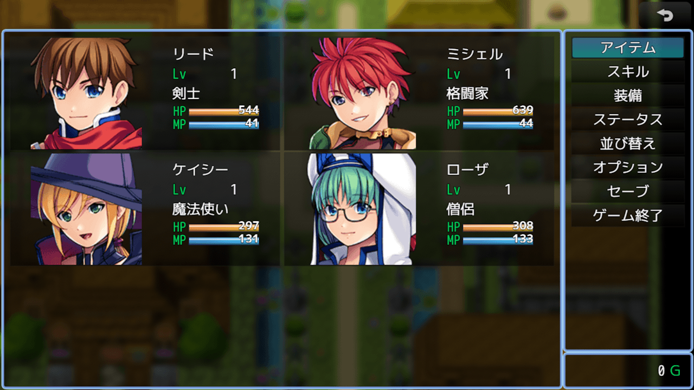
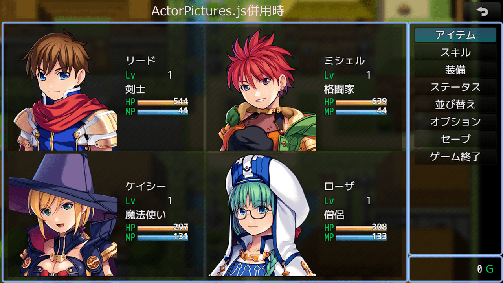
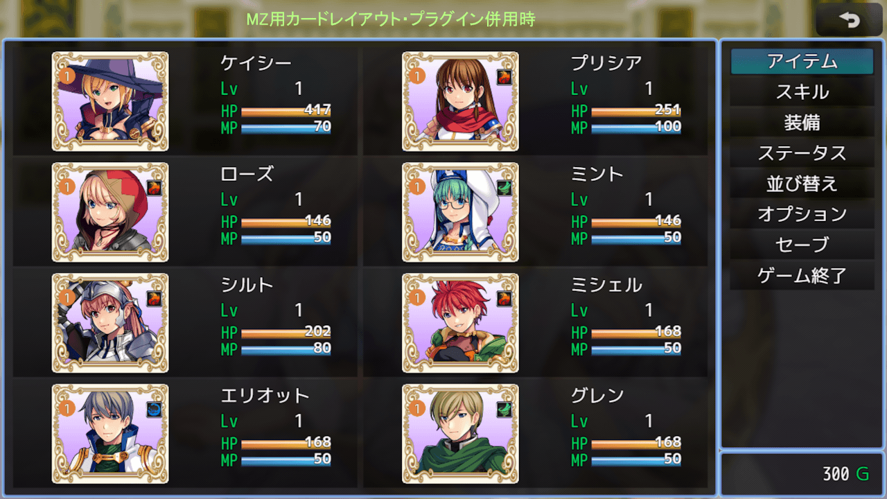
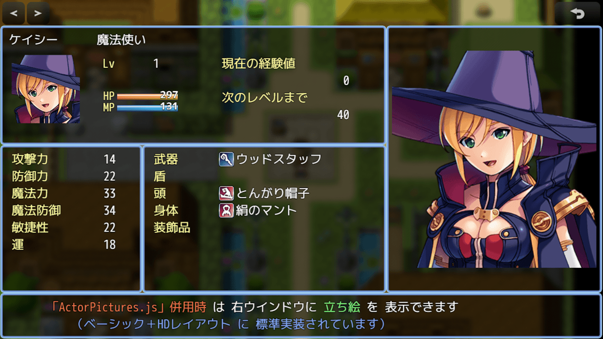

# シンプルなHDレイアウト・プラグイン（NLM_SimpleHDLayoutMZ.js）
### RPGツクールMZ専用プラグイン

シンプルなHDレイアウト（1280 × 720 ドット）へ各種メニューを最適化します

画面サイズを入力し直さなくてもHDサイズへ強制する機能があるので、以前に作成した作品や「ベーシック＋マップセット」などへも手軽に導入できます

### ＜「ベーシック＋HDレイアウト」に付属する HDLayout.js との違い＞

- メニュー画面：使い慣れた右縦コマンド欄に、アクター欄が2列のシンプルな構成（アクター縦人数は調整可）  
- ステータス画面：従来型ステータス画面そのままに右側画像ウインドウを追加
- アクター画像：「拡大顔画像」が標準で描画されますが、ActorPictures.js（「ベーシック＋HDレイアウト」で標準実装）併用で「立ち絵」を、[NLM_CardLayoutMZ.js](https://github.com/nolimits-tukool/NLM_CardLayoutMZ) (v1.1以降)併用で「カード画」を、置き換えて描画できます

### また、単独で以下の機能を持ち、HDLayout.jsと同時併用でも機能を追加できます

- ゲージの幅のほかに、高さの変更、ゲージ立体視化が可能
- システム文字色の変更  
- アイテム、スキル、セーブ、ショップの各リストの列数変更  
- 装備スロットの2列化  
- 敵リストの列数変更と敵名前の中央寄せ表示  
- 戦闘ステータスで4人以下の際の中央寄せ表示  
- SVアクター間のX間隔・Y間隔の変更、前進距離の変更  
- メッセージウインドウの幅変更の他に、選択肢をウインドウの端にそろえる機能

コマンドの高さも変更したい場合は [MZ用コマンド行間設定プラグイン](https://github.com/nolimits-tukool/NLM_CommandHeightMZ) の併用をお勧めします  
（HDLayout.js を同時併用する場合は、本プラグインより上に配置して下さい）

# download

プラグインの download は、[右クリック「名前を付けてリンク先を保存」](https://raw.githubusercontent.com/nolimits-tukool/NLM_SimpleHDLayoutMZ/refs/heads/main/NLM_SimpleHDLayoutMZ.js)  

# license

　MITライセンスの通りです

## [リポジトリ 一覧へ](https://github.com/nolimits-tukool?tab=repositories)
